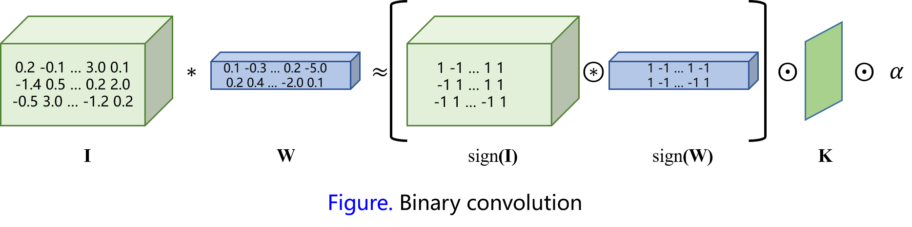
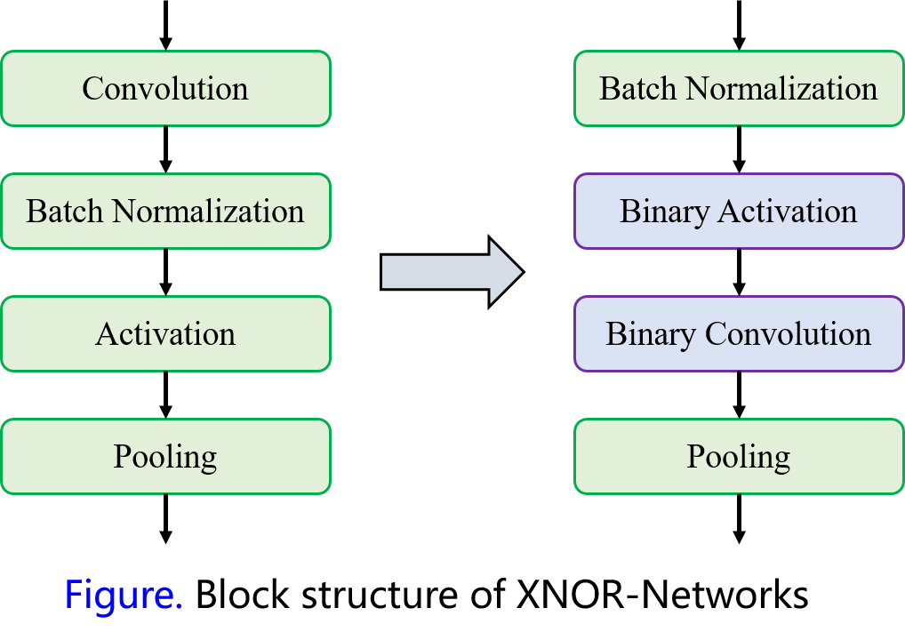

# BWN (Binary Weight Networks) and XNOR-Net

Although deep neural networks have shown great potential in several application domains including computer vision and speech recognition, it is hard to implement DNN methods in hardware with the limitation of storage, compute capabilities and battery power. The authors in this paper proposed two efficient approximation to the neural network: binary weight networks (BWN) and XNOR-Networks. In binary weight networks, all the weights are approximated with binary values. While in XNOR-Networks, both the weights and the inputs to the convolutional layers and fully connected layers are approximated with binary values. The authors also attempted to evaluate their methods on large scale data sets like ImageNet, and proved that their methods outperform baseline for about 16.3%. [Source code is available on GitHub](https://github.com/allenai/XNOR-Net).

## Binary Weight Networks

Represent an $$L$$-layer DNN model with a triplet $$<\mathcal{I, W}, * >$$. Each element $$I=\mathcal{I}_{l(l=1,\cdots,L)}$$ in $$\mathcal{I}$$ is the input tensor of the $$l^{th}$$ layer, $$W=\mathcal{W}_{lk(k=1,\cdots, K^l)}$$ is the $$k^{th}$$ weight filter in the $$l^{th}$$ layer of DNN. $$*$$ represents convolutional operation with $$I$$ and $$W$$. Note that the authors assume the convolutional layers in the network do not have bias terms. Thus the convolutional operation can be approximated by $$I*W\approx(I\oplus B)\alpha$$, where $$\oplus$$ indicates a convolution without multiplication, $$B=\mathcal{B}_{lk}$$ is a binary filter $$\alpha=\mathcal{A}_{lk}$$ is an scale factor and $$\mathcal{W}\approx\mathcal{A}_{lk}\mathcal{B}_{lk}$$.

The optimized objective function is shown as follows:
$$
J(B,\alpha) = \| W-\alpha B \|^2 \\ 
\alpha^*, \beta^* = \arg\min_{\alpha, B} J(B,\alpha) \tag{1}
$$
By solving the objective function mentioned above, we get:
$$
B^* = sign(W) \\ 
\alpha^* = \frac{1}{n} \|W\|_{l1} \tag{2}
$$

### Proof 1: solve objective function

$$
J(B,\alpha) = \| W-\alpha B \|^2 = \alpha^2B^\intercal B - 2\alpha W^\intercal B + W^\intercal W \tag{3}
$$

Since $$B\in\{+1, -1\}^n, B^\intercal B=n$$ are constants, and $$W^\intercal W$$ is also constant as $$W$$ is a known value. Thus the Equation (3) can be re-written as:
$$
J(B,\alpha) =\alpha^2n-2\alpha W^\intercal B+c \tag{4}
$$
Note that $$\alpha$$ is a positive value in Equation (4), then the solution of $$B^*$$ is:
$$
B^* = \arg\min_B\{W^\intercal B\}~~s.t. B\in\{+1, -1\}^n \\
B* = sign(W) \tag{5}
$$
Take the derivative of $$J$$, we have:
$$
\frac{\partial J}{\partial\alpha} = 2\alpha n-2W^\intercal B = 0 \\
\alpha^* = \frac{W^\intercal B^*}{n} = \frac{W^\intercal sign(W)}{n} = \frac{\sum |W_i|}{n} = \frac{1}{n}\|W\|_{l1} \tag{6}
$$

### Implementation in PyTorch

**Prepare: ** pre-train a DNN model (the authors did not mention that they use a pre-trained model or training from scratch)

**Step 1, quantization:** quantize weights of convolutional layers using Equation (2)

**Step 2, training:** apply standard forward and backward propagation to the network

**Step 3, update parameters:** update parameters with standard SGD

**Repeat:** repeat step 1 to step 3 until reach max iterations

Note that weights in BWN are still floating-point as the author use $$\alpha B$$ to approximate $$W$$. $$\alpha$$ is the mean of weights in every convolutional layer. The main idea of the authors is computing the best approximation of weights. However, optimal approximation to weights do not means optimal approximation to the final outputs of the network. Thus this kinds of methods may still lead to high loss of accuracy.

## XNOR-Networks

Based on the proposed binary weight networks, the authors further explore the method to binarize both weights and inputs. Convolutional operation consist of shift operation and dot product, and if the dot product can be expressed by binary operations, then convolution can be approximated using binary operations. The approximation of dot product between $$X, W\in \mathbb{R}^n$$ can be expressed by $$X^\intercal W\approx \beta H^\intercal \alpha B$$, where $$H,B\in \{+1,-1\}^n$$ and $$\beta, \alpha\in \mathbb{R}^+$$, then the optimized objective function is:
$$
\alpha^*,B^*, \beta^*, H^* = \arg\min_{\alpha, B,\beta, H} \| X\odot W - \beta\alpha H\odot B\|, \tag{7}
$$
where $$\odot$$ indicates the element-wise product. Define $$Y\in\mathbb{R}^n$$ such that $$Y_i = X_i W_i,~C\in\{+1,-1\}^n$$ such that $$C_i=H_i B_i$$ and $$\gamma\in\mathbb{R}^n$$ such that $$\gamma=\beta\alpha$$. Equation (7) can be written as:
$$
\gamma^*, C^* = \arg\min_{\gamma,C}\|Y-\gamma C\| \tag{8}
$$
Similar to the Equation (6), the optimal solutions of Equation (8) are shown as follows:
$$
C^* = sign(Y) = sign(X)\odot sign(W) = H^* \odot B^* \\
\gamma^* = \frac{\sum{|Y_i|}}{n}=\frac{\sum{|X_i||W_i|}}{n} \approx(\frac{1}{n}\|X\|_{l1})(\frac{1}{n}\|W\|_{l1}) = \beta^*\alpha^* \\
H^* = sign(X) \\
B^* = sign(W) \\
\beta^*= \frac{1}{n}\|X\|_{l1} \\ 
\alpha^*= \frac{1}{n}\|W\|_{l1} \tag{9}
$$

### Binary Convolution

With the binary weights and binary inputs of convolutional layer, the convolution operations can be approximated using binary operations:
$$
I*W \approx (sign(I)\circledast sign(W)) \odot K\alpha \tag{10}
$$
where $$\circledast$$ indicates a convolutional operation using XNOR and bit-count operations, $$K$$ contains scale factors $$\beta$$ for all sub-tensors in input $$I$$.

The authors suggested that applying pooling on binary input results in significant loss of information, thus they changed the standard convolutional blocks to pre-activated version.

**Binary Gradient:** similar to the binarization in the forward pass, the gradient in the backward pass can also be binarized. To preserve the maximum change of gradient, the authors use $$\max_i(|g_i^{in}|)$$ as the scale factor.

**$$k$$-bit Quantization:** the authors also mentioned that 1-bit quantization of weights can also be converted to k-bit quantization by using $$q_k(x)=2(\frac{[(2^k-1)(\frac{x+1}{2})]}{2^k-1}-\frac{1}{2}$$ instead of $$sign(x)$$ function, where $$[\cdot]$$ indicates rounding operation and $$x\in [-1,1]$$. 

### Implementation in PyTorch

The implementation of XNOR-Net is similar to those of BWN which including three steps: quantization, forward propagation and backward propagation.

### Experimental Results

In this paper, the authors conducted experiments on AlexNet and ResNet and validated the proposed methods using validation data set of ImageNet with single crop. The optimization method used in there experiments is ADAM as it can converge faster and have better performance with binary inputs. Experimental results are shown as follows:

| Model               | Top-1 Accuracy/ Top-5 Accuracy | Accuracy Loss    |
| ------------------- | ------------------------------ | ---------------- |
| AlexNet reference   | 56.6% / 80.2%                  |                  |
| AlexNet BC          | 35.4% / 61.0%                  | -21.2% / -19.2%  |
| AlexNet BWN         | 56.8% / 79.4%                  | 0.2% / -0.8%     |
| AlexNet BNN         | 27.9 % / 50.42%                | -28.7% / -29.78% |
| AlexNet XNOR-Net    | 44.2% / 69.2%                  | -12.4% / -11%    |
| ResNet-18 reference | 69.3% / 89.2%                  |                  |
| ResNet-18 BWN       | 60.8% / 83.0%                  | -8.5% / -5.8%    |
| ResNet-18 XNOR-Net  | 51.2% / 73.2%                  | -18.1% / -16%    |
| GoogLeNet reference | 71.3% / 90.0%                  |                  |
| GoogLeNet BWN       | 65.5% / 86.1%                  | -5.8% / -3.9%    |