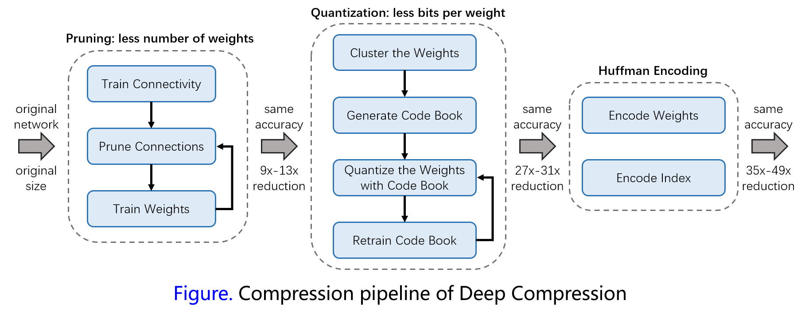

# Deep Compression

In this paper the authors introduces "deep compression" to compress model size of deep convolutional neural networks. The proposed method consists of three stage: pruning, trained quantization and [Huffman coding](https://en.wikipedia.org/wiki/Huffman_coding). The authors first prunes weights by learning the important connections. Second, quantize weights to enforce weight sharing. Third, apply Huffman coding to reduce storage further. 

## Proposed Methods

[Network Pruning](http://papers.nips.cc/paper/5784-learning-both-weights-and-connections-for-efficient-neural-network.pdf): First, learn connectivity by normal network training. Second, remove weights below threshold. Third,  retrain the network to learn the final weights for remaining sparse connections. After pruning, the sparse structure is stored using compress sparse row (CSR) or compress sparse column (CSC).

Trained Quantization: use $$k$$-clusters with $$b$$-bits to represent $$n$$-connections of the network. The compression rate can be computed by:
$$
r=\frac{nb}{nlog_2(k)+kb} \tag{1}
$$
The authors use k-means algorithm to get $$k$$-clusters $$C=\{c_1, c_2,\dots,c_k\}$$ to represent  $$n$$ original weights $$W=\{w_1, w_2, \dots,w_n\}$$, and the optimized objective function is:
$$
\arg\min_C\sum_{i=1}^{k}\sum_{w\in c_i} |w-c_i|^2 \tag{2}
$$
As the initialization of k-means algorithm is quite important, the authors explored three initial methods including forgy (random), density-based, linear. The authors suggested that using linear initialization can get better result as it has better representation to the few large weights which are important to the networks.

Once the centroids of weights are decided by k-means clustering, the index of sharing weight table is stored for each connections and used when conducting forward or backward propagation. Gradients for the shared weights are computed by:
$$
\frac{\partial \mathcal{L}}{\partial C_k} = \sum_{i,j}\frac{\partial \mathcal{L}}{\partial W_{i,j}}\frac{\partial W_{i,j}}{\partial C_k} = \sum_{i,j}\frac{\partial{\mathcal L}}{\partial W_{i,j}}\mathbb{1}(I_{i,j}=k), \tag{3}
$$
where $$\mathcal{L}$$ indicates loss, $$W_{i,j}$$ indicates weight in the $$i$$-th column and $$j$$-th row, $$C_k$$ indicates the $$k$$-th centroid of the layer and $$\mathbb{1}(\cdot)$$ is an indicator function.

## Experimental Results

The authors conducted experiments on two data sets: on MNIST, they used LeNet-300-100 and LeNet-5 while used AlexNet and VGG-16 on ImageNet to evaluate the proposed methods. Results on MINIST are summarized as follows:

| Model                    | Top-1 (/ Top-5 Error) | Accuracy Loss | Parameters | Compression Rate |
| ------------------------ | --------------------- | ------------- | ---------- | ---------------- |
| LeNet-300-100 reference  | 1.64%                 | -             | 1070 KB    | -                |
| LeNet-300-100 compressed | 1.58%                 | 0.06%         | 27 KB      | 40 $$\times$$    |
| LeNet-5 reference        | 0.80%                 | -             | 1720 KB    | -                |
| LeNet-5 compressed       | 0.74%                 | 0.06%         | 44 KB      | 39 $$\times$$    |
| AlexNet reference        | 42.78% / 19.73%       | -             | 240 MB     | -                |
| AlexNet compressed       | 42.78% / 19.70%       | 0% / 0.03%    | 6.9 MB     | 35 $$\times$$    |
| VGG-16 reference         | 31.50% / 11.32%       | -             | 552 MB     | -                |
| VGG-16 compressed        | 31.17% / 10.91%       | 0.33% / 0.41% | 11.3 MB    | 49 $$\times$$    |

