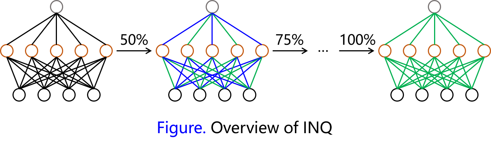
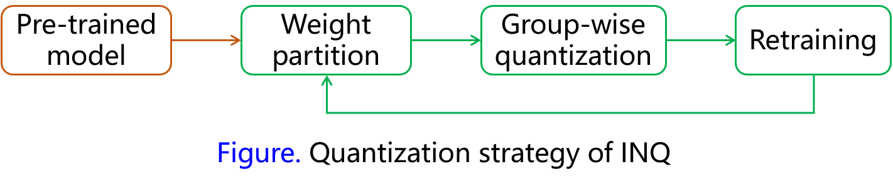

# Quantization Methods

## INQ (Incremental Network Quantization)

As most of the existing methods suffer from high decreasing on model performance and need many training epochs, the authors provided a lossless quantization method to overcome these problems. The proposed method mainly contains three steps: weight partition, group-wise quantization and re-training. Given a trained model, the first step of INQ is to divide weights of the model into to group, one for quantization and another for re-training. Second, apply weight quantization and convert 32-bits floating point data to low precision data. Third, freeze the quantized weights and retraining the network using SGD, then update remaining weights of the network. Repeating these three steps until all weights are quantized, then we can get a low precision model without significant accuracy loss. Considering binary shift operation is more efficient in hardware, the authors quantize weights of convolutional layers and fully connected layers to the  power of 2. 

### Weight Quantization Strategy

Suppose weights of a pre-trained full precision model can be represented by $$\{ W_l: 1 \le l \le L \}$$, the quantized weights are represented by $$\widehat{W_l}$$ , where each item is chosen from $$P_l = \{\pm2^{n_1}, \cdots, \pm2^{n_2}, 0\}$$. The quantization method is formulated by
$$
\widehat{W_l}(i, j) =
\begin{cases}
\beta sgn(W_l (i, j))&if (\alpha + \beta)/2 \le abs(W_l (i, j)) \lt 3\beta/2 &\\
0 & otherwise,
\end{cases} \tag{1}
$$
where $$\alpha$$ and $$\beta$$ are two adjacent elements in the sorted $$P_l$$. Based on Equation (1), $$n_1$$ and $$n_2$$ in $$P_l$$ can be computed by

$$n_1 = floor(log_2(4s/3))$$, where $$s=max(abs(W_l))$$;

$$n_2 =  n_1+1-2^{(b-1)}/2$$, where $$b$$ is the quantized bit-width.

#### Proof 1: compute factor 4/3 of $n_1$

Considering the extremely condition in Equation (1), we have 

$$(2^{n_1-1} + 2^{n_1})/2 \le max(abs(W_l)) \le3\cdot2^{n_1}/2$$.

Then, 

$$2^{n_1-1}\le2max(abs(W_l))/3\lt2^{n_1}$$,

$$n_1-1\le log_2(2max(abs(W_l))/3)\lt n_1$$

$$n_1\le log_2(4max(abs(W_l))/3)\lt n_1+1$$

Because

$$floor(x)\le x \le ceil(x)$$, 

then we let $$n_1=floor(4max(abs(W_l))/3)$$.

For simplifying the equation, define $$s=max(abs(W_l))$$, then we have $$n_1 = floor(log_2(4s/3))$$.

#### Proof 2: compute $n_2$

As $$b$$ denotes the expected bit-width, one bit for zero and others for representing the powers of 2, which including $$2^{b-1}$$ different values. Here we have $$(n_1-n_2+1)\cdot2= 2^{b-1}$$ according to definition of $$P_l$$. Thus $$n_2$$ can be computed by $$n_2 = n_1+1-2^{b-1}/2$$.

### Weight Partition Strategies

In this paper, the authors explored two kinds of weight partition strategies, including random partition and pruning-inspired partition. The second partition strategy considers that weights with larger absolute values are more important than the smaller ones and would have more possibility to be quantized. The experimental results also shows that the pruning-inspired strategy outperforms the first one for about 0.8% with ResNet-18.

### Implementation in PyTorch

**Prepare:** pre-train a full-precision model

**Step1, weight partition: **

1. decide number of weights to be quantized according to portion $$\{\sigma_1, \sigma_2, \cdots, \sigma_n\}$$ 
2. generate quantization mask $$T_l(i, j)\in \{0,1\}$$ using pruning-inspired strategy

**Step2, group-wise quantization:**

1. quantize weights according to mask $$T_l$$ 
2. in order to make sure the quantized weights not be changed during re-training phase, here we save weights as $$\widehat{W}$$

**Step3, re-training: **

1. reset learning rate
2. apply forward, backward and computing gradient
3. update weights by using SGD
4. reload quantized weight from $$\widehat{W}$$ partially according to mask $$T_l$$
5. repeating operations 2 to 4 with full training phase.

**Repeat: ** repeat step1 to step 3 until all weights are quantized.

### Experimental Results

The authors adopted the proposed method to several model, including AlexNet, VGG-16, GoogleNet, ResNet-18 and ResNet-50. More experiments for exploration was conducted on ResNet-18. Experimental results on ImageNet using center crop validation are shown as follows.

| Network       | Bit-width | Top-1/Top-5 Error | Decrease in Top-1/Top-5 Error | Portion                   |
| ------------- | :-------- | ----------------- | ----------------------------- | ------------------------- |
| AlexNet ref   | 32        | 42.71%/19.77%     |                               |                           |
| AlexNet       | 5         | **42.61%/19.54%** | 0.15%/0.23%                   | {0.3, 0.6, 0.8, 1.0}      |
| VGG-16 ref    | 32        | 31.46%/11.35%     |                               |                           |
| VGG-16        | 5         | **29.18%/9.70%**  | 2.28%/1.65%                   | {0.5, 0.75, 0.875, 1.0}   |
| GoogleNet ref | 32        | 31.11%/10.97%     |                               |                           |
| GoogleNet     | 5         | **30.98%/10.72%** | 0.13%/0.25%                   | {0.2, 0.4, 0.6, 0.8, 1.0} |
| ResNet-18 ref | 32        | 31.73%/11.31      |                               |                           |
| ResNet        | 5         | **31.02%/10.90%** | 0.71%/0.41                    | {0.5, 0.75, 0.875, 1.0}   |
| ResNet-50 ref | 32        | 26.78%/8.76%      |                               |                           |
| ResNet-50     | 5         | **25.19%/7.55%**  | 1.59%/1.21%                   | {0.5, 0.75, 0.875, 1.0}   |

Number of required epochs for training increasing with the expected bit-width going down. The accumulated portions for weight quantization are set as {0.3, 0.5, 0.8, 0.9, 0.95, 1.0}, {0.2, 0.4, 0.6, 0.7, 0.8, 0.9, 0.95, 1.0}, {0.2, 0.4, 0.6, 0.7, 0.8, 0.85, 0.9, 0.95, 0.975,  1.0} for 4-bits to 2-bits, respectively. Training epochs required for 2-bits finally set to 30 which means that 300 training epochs are required for completing a full quantization procedure. In the other words, the proposed method become time-consuming when the network going deeper.

Although the authors convert weights to the powers of 2 and claim that their method would be efficient with binary shift operation in hardware, the computation in there experiments is still using floating operations. Thus they only show the results of model compression instead of speeding up computation.