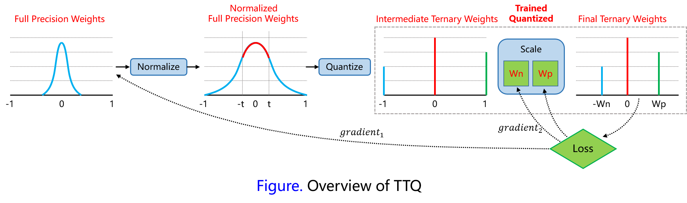

# TTQ (Trained Ternary Quantization)

The ternary quantization methods proposed in this paper based on threshold and quantized weights to 0 and {-1, +1} with two different scaling factor. The authors also suggested the rule of scaled gradient to update weight in different group. Quantized ternary weight $$w_l^i$$ of the network can be calculated by:
$$
w_l^t = 
\begin{cases}
W_l^p&:& \tilde{w_l} \gt \triangle_l \\
0&:& |\tilde{w_l}| \le \triangle_l \\
-W_l^n&:& \tilde{w_l} \lt -\triangle_l
\end{cases} \tag{1}
$$
Different from previous work where weights are calculated from 32-bit weights, the scaling coefficients $$W_l^p, W_l^n$$ are two independent parameters and are trained with gradient descent:
$$
\frac{\partial L}{\partial W_l^p} = \sum_{i\in I_l^p}\frac{\partial L}{\partial w_l^t(i)}, \\
\frac{\partial L}{\partial W_l^n} = \sum_{i\in I_l^n}\frac{\partial L}{\partial w_l^t(i)}, \tag{2}
$$
Here $$I_l^p=\{i|\tilde{w_l}(i) \gt \triangle_l\}$$ and $$I_l^n=\{i|\tilde{w_l}(i) \lt -\triangle_l\}$$. The proposed scaled gradients for 32-bit are weights computed by:
$$
\frac{\partial L}{\partial\tilde{w_l}} = 
\begin{cases}
W_l^p\times\frac{\partial L}{\partial w_l^t}&:&\tilde{w} \gt \triangle_l \\
1\times\frac{\partial L}{\partial w_l^t}&:&|\tilde{w}| \le \triangle_l \\
W_l^n\times\frac{\partial L}{\partial w_l^t}&:&\tilde{w} \lt -\triangle_l
\end{cases} \tag{3}
$$
Different from TWN, the authors explored two strategies to decide the values of thresholds: (1) $$\triangle_l=t\times\max(|\tilde{w}|)$$, $$t$$ is set to 0.05 on CIFAR-10 and ImageNet; (2) $$\triangle_l=r$$, where $$r$$ is a hyper-parameter and adjusted with various sparsities. For exploring the trade-off between sparsity and accuracy, the sparsity of weights are growing from 0 to 0.5 and the best result occurs with  sparsity between 0.3 and 0.5.

## Training Methods

**First:** normalize full-precision weights to range $$[-1, +1]$$ by dividing each weight by the maximum weight

**Second:** quantize weights to $$\{-W_l^n, 0, W_l^p\}$$ with threshold factor $$t$$

**Third:** compute the scaled gradients and update the scaling coefficients with back propagation

[Source code](https://github.com/czhu95/ternarynet) is available on GitHub.

## Experimental results

Testing error on CIFAR-10 with ResNet is shown as follows:

| Model     | Full precision | Trained Ternary Quantization | Improvement |
| --------- | -------------- | ---------------------------- | ----------- |
| ResNet-20 | 8.23           | 8.87                         | -0.64       |
| ResNet-32 | 7.67           | 7.63                         | 0.04        |
| ResNet-44 | 7.18           | 7.02                         | 0.16        |
| ResNet-56 | 6.80           | 6.44                         | 0.36        |

The authors further evaluate their method on ImageNet with AlexNet and ResNet-18B. To AlexNet, the authors preserves full precision weights in first convolutional layer and the last fully-connected layer, and other layer parameters are quantized to ternary values. Experimental results are shown as follows:

| Model                | Bit-width | ImageNet Top-1/Top-5 Error | Accuracy Loss   |
| -------------------- | --------- | -------------------------- | --------------- |
| AlexNet reference    | 32        | 42.8 / 19.7                | -               |
| AlexNet DoReFa       | 1         | 46.1 / 23.7                | -3.3 / -4.0     |
| AlexNet TWN          | 2         | 45.5 / 23.2                | -2.7 / -3.5     |
| AlexNet TTQ          | 2         | **42.5 / 20.3**            | **-0.3 / -0.6** |
| ResNet-18B reference | 32        | 30.4 / 10.8                | -               |
| ResNet-18B DoReFa    | 1         | 39.2 / 17.0                | -8.8 / -6.2     |
| ResNet-18B TWN       | 2         | 34.7 / 13.8                | -4.3 / -3.0     |
| ResNet-18B TTQ       | 2         | **33.4 / 12.8**            | **-3.0 / -2.0** |