# Multi-Function Table Upgrade Again
---

GitHub地址：https://github.com/ICEORY/Learning-C-Plus-Plus/tree/master/multifunction-table-upgrade-again

## 功能说明

1. 创建一个表格，输入表格名称，列数，列名称
2. 输入各列的数据类型、数据内容
3. 选择对数据进行正序或者倒序排序、筛选
4. 退出表格
5. 选择是否继续创建表格
6. 重复以上步骤，或者可以选择显示所创建的各种表格或者退出
7. 退出整个程序

## 结果展示

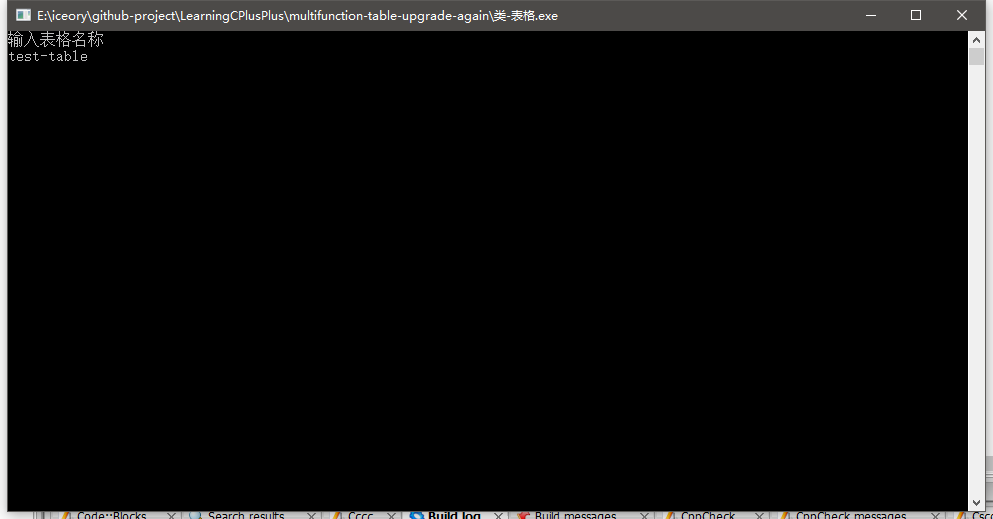

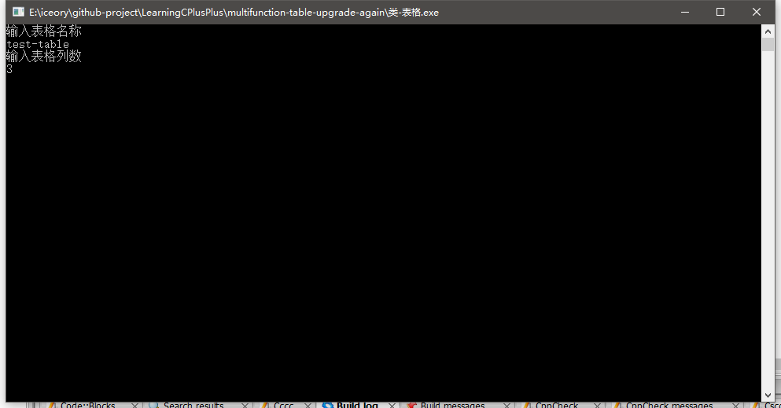

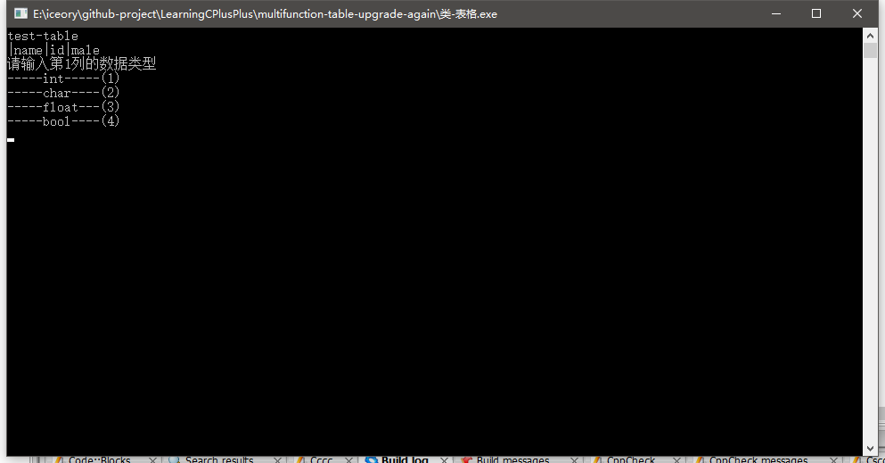

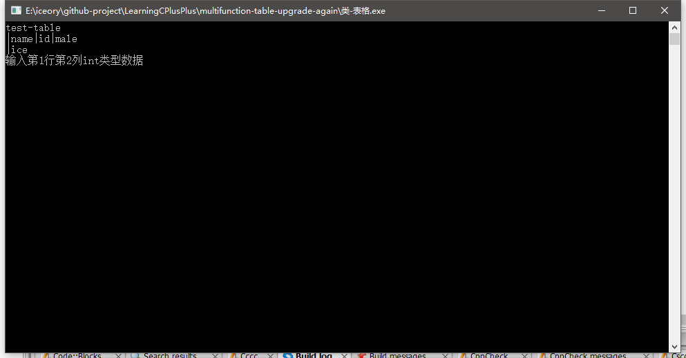

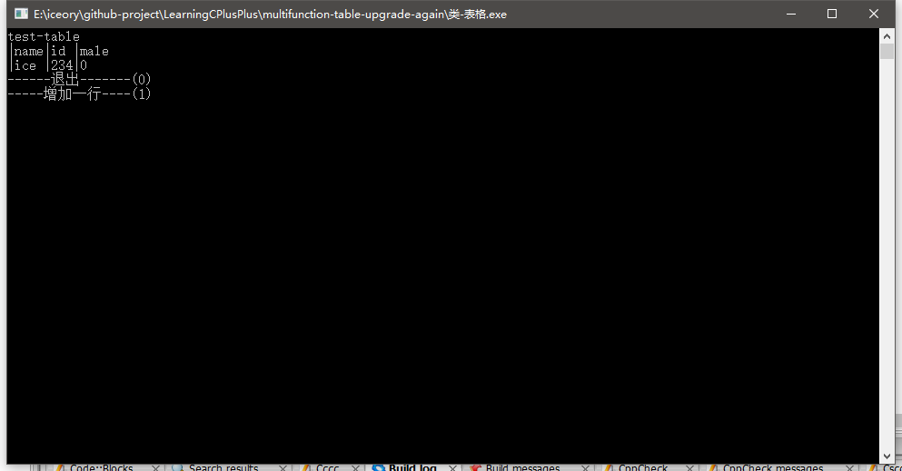

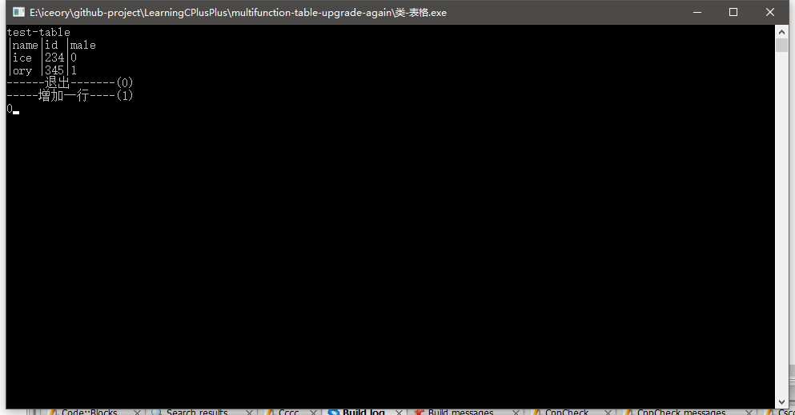

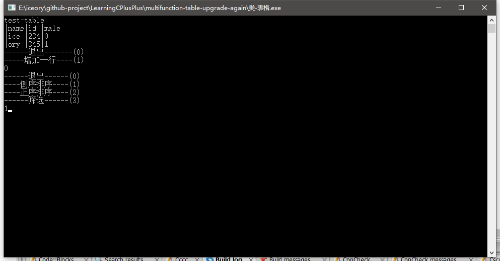

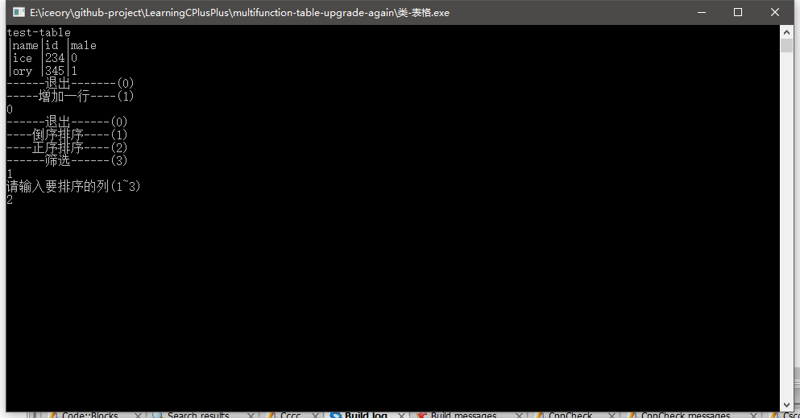

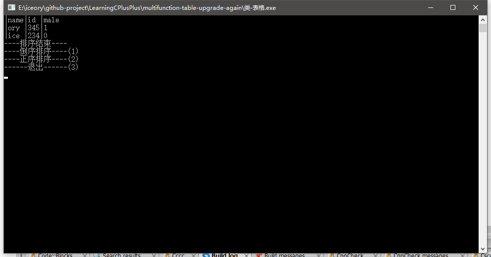

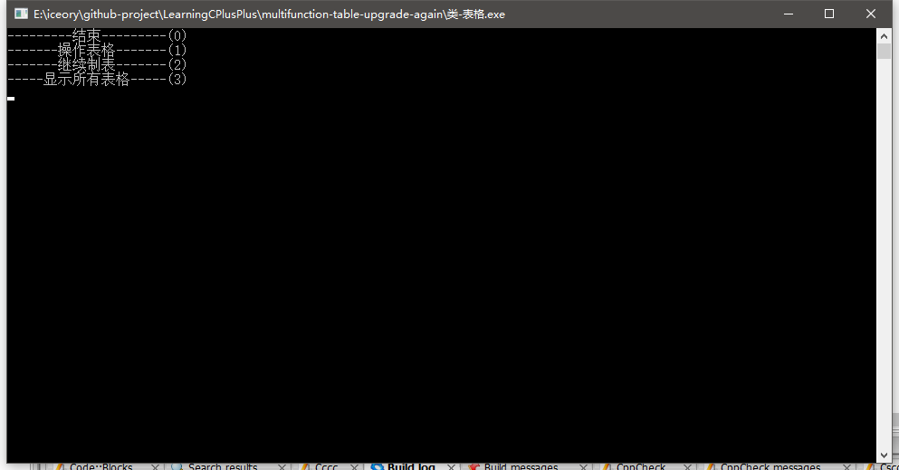

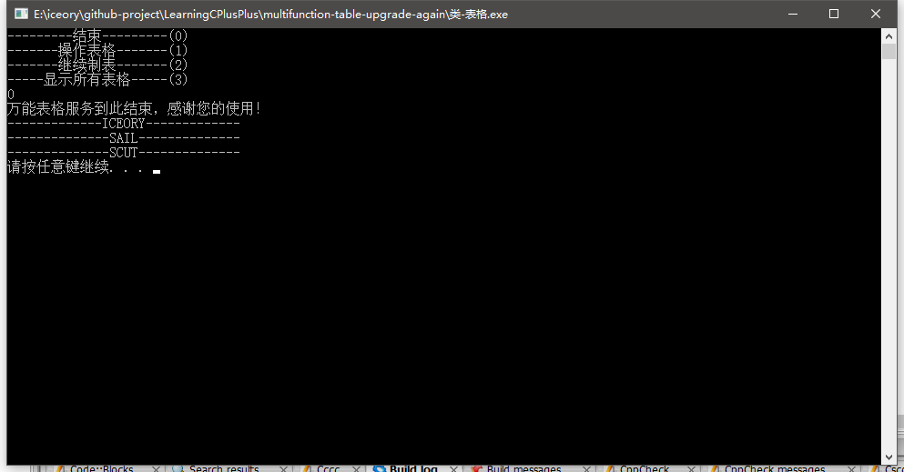

