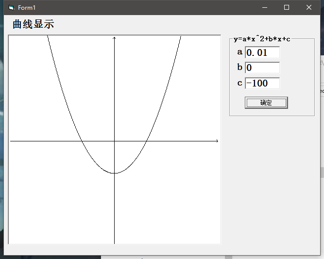
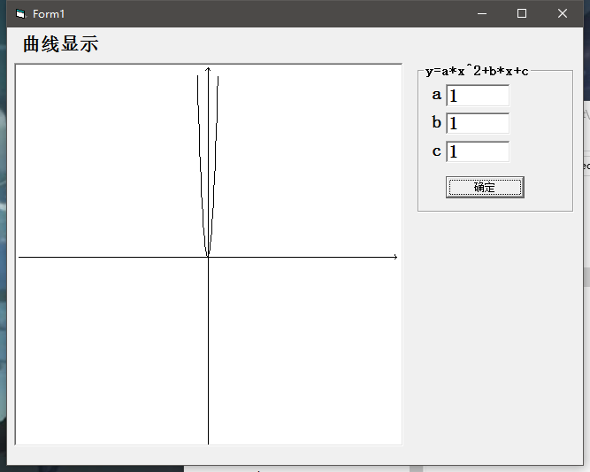

# Quadratic Curves
---

GitHub地址：https://github.com/ICEORY/LearningVB/tree/master/quadratic-curves

## 功能说明：

1. 根据设定的参数绘制二次曲线

## 结果展示

1.  a = 0.01, b = 0, c = -100

   

2.  a = 0.1, b = 1, c = 1

   

3.  a = 1, b = 1, c = 1

   