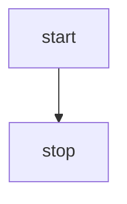
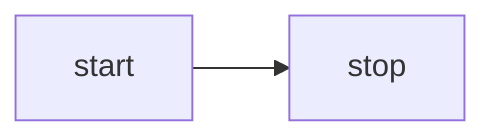
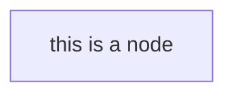
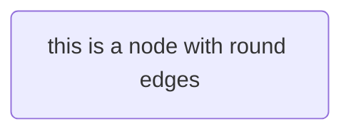
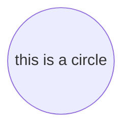

# markdown
---

## markdown 基本教程
参考 [1]：http://itmyhome.com/markdown/article/extension/task-list.html

主要包括 markdown 的基本语法、扩展语法、编辑器以及扩展、格式转换等方面的内容；

## markdown mermaid
参考 [1] https://mermaidjs.github.io/flowchart.html

mermaid 是 markdown 中用于画图的工具，基本语法如下：



其中 graph TD 表示画图的方向，表示方向的语法：
- TB - top bottom
- BT - bottom top
- RL - right left
- LR - left right
- TD - same as TB

### 其他基本语法：
#### 形状
1. 带文字的节点


2. 带圆角的节点


3. 圆形的节点


4. 不对称形状：id1>This is the text in the box]

5. 斜方形：id1{This is the text in the box}

#### 连接方式
1. 实线箭头： A-->B

2. 实线连接： A --- B

3. 带文字连接： 
A-- This is the text ---B 或者 A---|This is the text|B

4. 带文字箭头连接：

A-->|text|B

A-- text -->B

5. 虚线连接： A-.->B;

6. 粗箭头： A ==> B

##### 子图
```
subgraph title
    graph definition
end
```

## markdown latex
[1] https://www.zybuluo.com/fyywy520/note/82980

